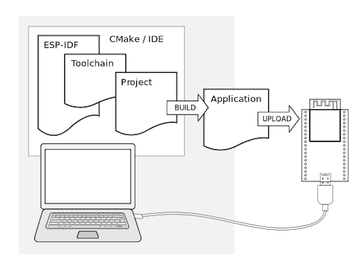

# หัวข้อการเรียนรู้  ESP32-IDF-Project

1. ESP32 Project

ESP32 project เป็น folder ที่รวมไฟล์ต่างๆ ที่ใช้งานร่วมกันเพื่อสร้างไฟล์ที่รันบน ESP32 ได้ ซึ่งไฟล์เหล่านั้นอาจจะเป็นได้ทั้ง Source code, header file, script รวมทั้งไฟล์ที่เกิดจากการ build ของ toolchain 

โดยทั่วไปแล้ว การ build ของโปรเจคที่มี source code เป็นภาษาซี จะมีกระบวนการที่เรียกว่าการคอมไพล์ (โดย compiler) ทำหน้าที่แปลง source code  เป็น object code แต่จะยังไม่สามารถรันบน ESP32 ได้โดยตรง จะต้องมีการเชื่อม (โดย Linker) เข้ากับ object code ส่วนอื่น ๆ  รวมทั้ง code จาก Library เสียก่อน จากนั้นจะนำ object code สุดท้ายที่ได้มาจัดเรียงและนำไปวางในหน่วยความจำของ ESP32 ตาม script ควบคุมตำแหน่งของ object ในหน่วยความจำ  ซึ่งทั้งหมดจะถูกดำเนินการโดยอัตโนมัติ 

เพื่อให้ toolchain ต่างๆ ทำงานได้อย่างถูกต้อง เราต้องรู้โครงสร้างของโฟลเดอร์ที่เก็บไฟล์ต่าง ๆ และการเชียนรายละเอียดในไฟล์ script ที่ทำหน้าที่ควบคุมการ build ทั้งหมด ไม่ว่าจะเป็นตำแหน่งที่เก็บ source code, ตำแหน่งของไฟล์ header เงื่อนไขต่างๆ ในการ build  ซึ่งโปรแกรมที่ตอยดำเนินการตระเตรียมสิ่งต่างๆ จนนำไปสู่การ build ได้สำเร็จนั้นเรียกว่า Ninja builder 

2. Folder structure

3. ไฟล์ต่าง ๆ

3.1 รายละเอียดของไฟล์
